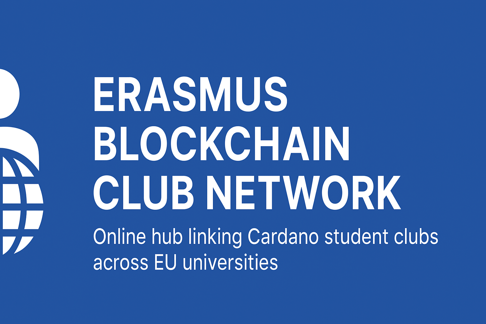

# Erasmus Blockchain Club Network

**Category:** Catalyst Fund 14 – Ecosystem: Community & Outreach  
**Budget:** 36,500 ADA  
**Duration:** 4 months  

---

## 📌 Overview
An online hub connecting Cardano-focused student clubs across EU universities, starting with Erasmus exchange student communities. The platform will centralize events, share resources, and provide a space for cross-border collaboration between clubs.

---

## 🎯 Goals
- Build an MVP online platform featuring:
  - Club directory
  - Event calendar
  - Resource library
  - Member accounts
- Onboard at least 15 active clubs in the first 4 months.
- Publish open-source templates and guides for running Cardano clubs.
- Establish a sustainable communication channel for ongoing cooperation.

---

## 📂 Repo Structure
- **`/docs`** – Proposal, milestones, budget, platform specs, guides
- **`/platform`** – Source code for the online hub (MVP)
- **`/materials`** – Onboarding guides, media assets
- **`/media`** – Screenshots, logos, design files

---

## 🛠 Current Status
In planning and early outreach to student club leaders across Europe.

---

## 🌍 License
All content is released under the [MIT License](LICENSE).

  

<h1 align="center">Erasmus Blockchain Club Network</h1>

  Online hub linking Cardano student clubs across EU universities

  
  
  

---

## 📫 Contact
**Project Lead:** John G.
Email: erasmuscardanoclub@gmail.com
